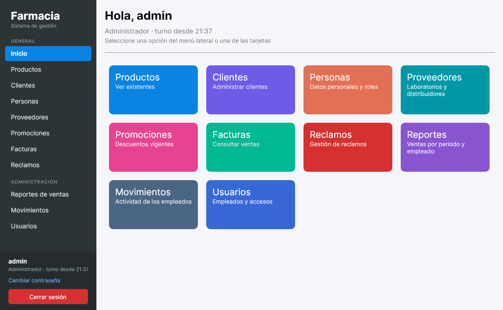
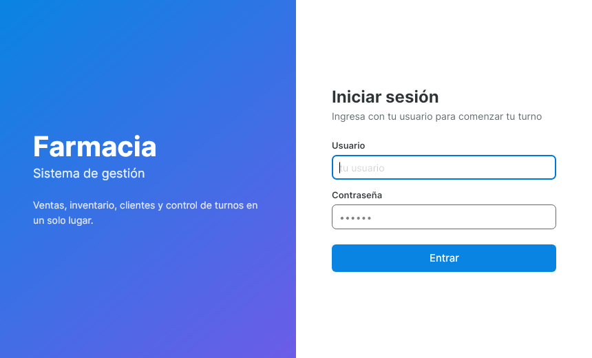
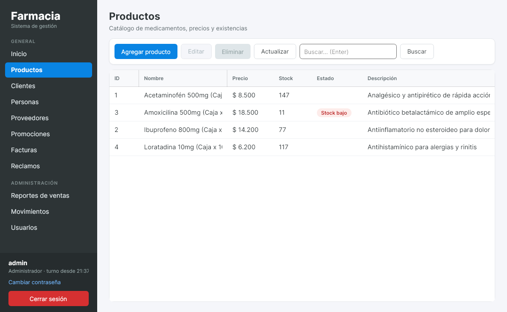
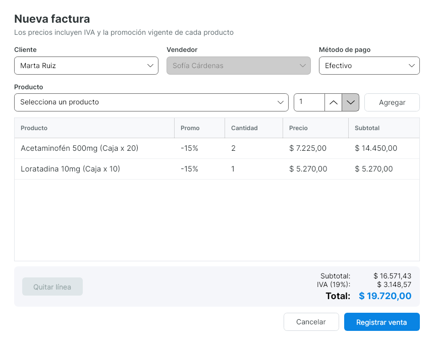
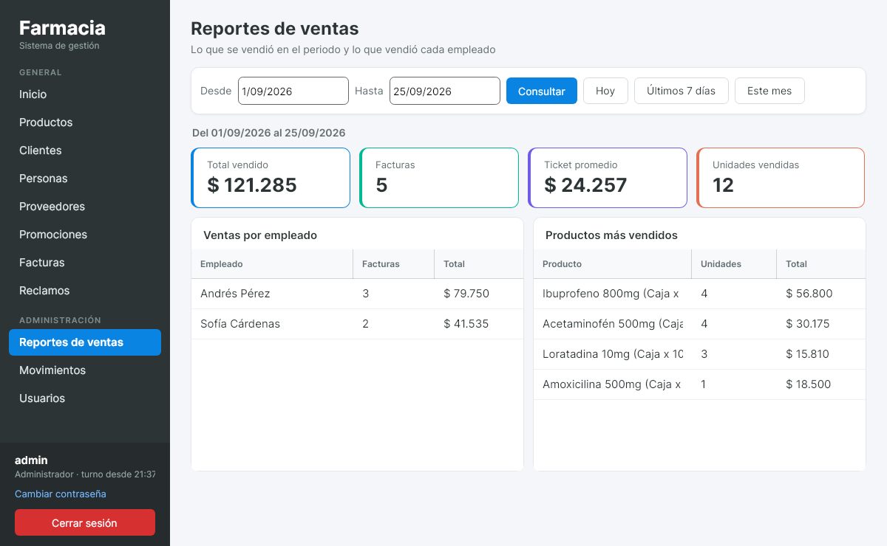
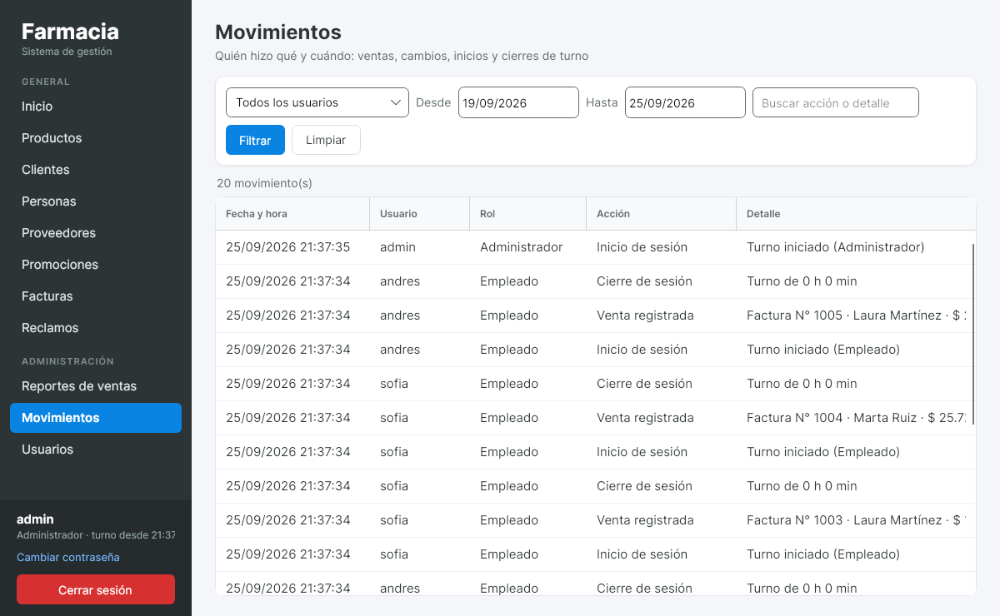
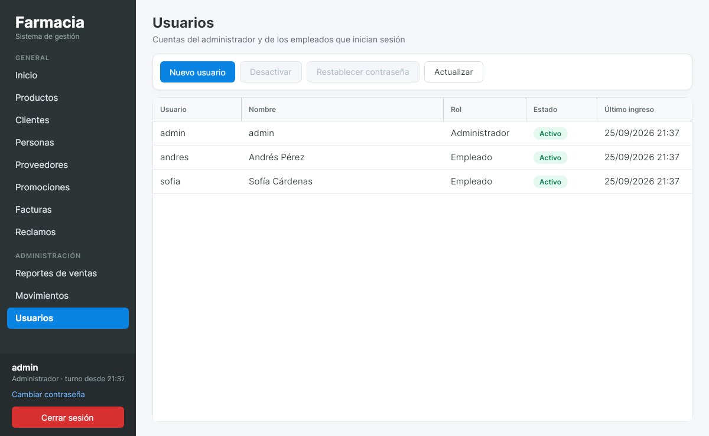

# FarmaciaApp

Sistema de escritorio para la gestión de una farmacia: ventas con facturación, inventario, clientes,
proveedores, promociones, reclamos y **control de turnos** de los empleados.

Funciona en **Windows y Linux** (y macOS). Está hecho en **.NET 10** con **Avalonia** para la interfaz,
**Dapper** para el acceso a datos y **Oracle** como base de datos.



---

## Contenido

1. Funcionalidades
2. Tecnologías
3. Arquitectura
4. Base de datos
5. Instalación
6. Ejecución y publicación
7. Guía de uso
8. Solución de problemas

---

## 1. Funcionalidades

| Módulo | Qué permite |
|---|---|
| **Inicio de sesión y turnos** | Cada empleado entra con su usuario. "Cerrar sesión" deja la aplicación lista para el siguiente turno. |
| **Productos** | Catálogo con precio (IVA incluido) y stock. Los productos con 20 unidades o menos se marcan con *Stock bajo*. |
| **Ventas (Facturas)** | Registrar ventas con varios productos; se aplica la promoción vigente, se separa el IVA y se descuenta el stock. |
| **Clientes y personas** | Datos personales de clientes, vendedores y empleados. |
| **Proveedores** | Laboratorios y distribuidores. |
| **Promociones** | Descuentos con fechas de vigencia, asociados a productos. |
| **Reclamos** | Reclamos de los clientes sobre una factura, con su estado. |
| **Reportes de ventas** *(administrador)* | Total vendido, facturas, ticket promedio y unidades por periodo; ventas por empleado y productos más vendidos. |
| **Movimientos** *(administrador)* | Registro de lo que hace cada usuario: ventas, cambios de precio y stock, inicios y cierres de turno, intentos fallidos de ingreso. |
| **Usuarios** *(administrador)* | Crear cuentas, activarlas o desactivarlas y restablecer contraseñas. |

---

## 2. Tecnologías

| Componente | Uso |
|---|---|
| [.NET 10](https://dotnet.microsoft.com/) | Plataforma y lenguaje C# |
| [Avalonia 11](https://avaloniaui.net/) | Interfaz gráfica multiplataforma (XAML) |
| [CommunityToolkit.Mvvm](https://learn.microsoft.com/dotnet/communitytoolkit/mvvm/) | Patrón MVVM (propiedades observables y comandos) |
| [Dapper](https://github.com/DapperLib/Dapper) | Consultas SQL a objetos |
| [Oracle.ManagedDataAccess.Core](https://www.nuget.org/packages/Oracle.ManagedDataAccess.Core) | Conexión a Oracle |
| Oracle Database 18c o superior | Base de datos (en desarrollo: Oracle Free en Docker) |

---

## 3. Arquitectura

La solución tiene dos proyectos:

```
FarmaciaApp/
├── FarmaciaApp.Core/            Lógica de negocio y acceso a datos (sin interfaz gráfica)
│   ├── Database/                Conexión a Oracle (DbConfig, OracleDbConnection)
│   ├── Models/                  Entidades: Producto, Factura, Cliente, Usuario, Movimiento...
│   ├── Repository/              Consultas SQL con Dapper, una clase por tabla principal
│   ├── Service/                 Reglas de negocio, permisos y registro de movimientos
│   ├── Seguridad/               Hash de contraseñas (PBKDF2)
│   ├── Sesion.cs                Usuario del turno actual y validación de permisos
│   └── Formato.cs               Formato de moneda en pesos colombianos
├── FarmaciaApp.Desktop/         Aplicación de escritorio (Avalonia)
│   ├── Views/                   Ventanas y pantallas (.axaml)
│   ├── ViewModels/              Lógica de cada pantalla (MVVM)
│   ├── Services/Dialogs.cs      Mensajes y confirmaciones
│   ├── App.axaml                Estilos globales (colores, botones, tablas)
│   └── appsettings.example.json Plantilla de la conexión a la base de datos
├── database/
│   ├── schema.sql               Crea todas las tablas y los datos de ejemplo
│   ├── migracion_ids.sql        Actualiza bases creadas con versiones anteriores
│   └── migracion_usuarios.sql   Agrega usuarios y movimientos a bases anteriores
├── docs/capturas/               Capturas de pantalla de este documento
├── docker-compose.yml           Oracle Free para desarrollo
└── Doxyfile                     Configuración de la documentación
```

### Flujo de una operación

Así viaja, por ejemplo, el registro de una venta:

```
NuevaFacturaView (pantalla)
   │  el usuario pulsa "Registrar venta"
   ▼
NuevaFacturaViewModel         arma las líneas y calcula los totales en pantalla
   │
   ▼
FacturaService (Core)         valida los datos y los permisos (Sesion); un empleado vende a su nombre
   │
   ▼
FacturaRepository (Core)      en UNA transacción: bloquea los productos, verifica el stock,
   │                          toma los precios de la base, guarda pago, factura y líneas,
   │                          descuenta el stock
   ▼
Oracle                        si algo falla, se deshace todo (rollback)
   │
   ▼
Auditoria.Registrar           guarda "Venta registrada" en TBL_MOVIMIENTO
```

Todas las pantallas siguen el mismo camino: **Vista → ViewModel → Servicio → Repositorio → Oracle**.

- **Las reglas y los permisos están en los servicios de Core**, no en las pantallas. Esconder un botón es solo
  comodidad; aunque alguien llamara al servicio directamente, el servicio verifica el rol.
- **Sesion** guarda el usuario que inició sesión. Sin sesión no se puede modificar nada.
- **Auditoria** registra cada operación exitosa con el usuario, la fecha y un detalle legible.

---

## 4. Base de datos

El esquema completo está en [`database/schema.sql`](database/schema.sql): borra y crea las tablas,
secuencias y restricciones, e inserta datos de ejemplo.

### Tablas

| Tabla | Contenido | Llave primaria |
|---|---|---|
| `TBL_PERSONA` | Datos personales (nombre, apellido, dirección, teléfono, email) | `PER_ID` (secuencia `SEQ_PERSONA`) |
| `TBL_CLIENTE` | Personas que son clientes | `CLI_ID` (identidad) |
| `TBL_VENDEDOR` | Personas que pueden vender | `VEN_ID` (identidad) |
| `TBL_PRODUCTO` | Medicamentos y artículos, con precio y stock | `PRO_ID` (secuencia `SEQ_PRODUCTO`) |
| `TBL_PROVEEDOR` | Laboratorios y distribuidores | `PRO_ID` |
| `TBL_PROMOCION` | Descuentos con fecha de inicio y fin | `PRM_ID` |
| `TBL_PAGO` | Pago de cada venta (método y monto) | `PAG_ID` |
| `TBL_FACTURA` | Ventas: cliente, vendedor, subtotal, IVA y total | `FAC_NUM_FACTURA` |
| `TBL_RECLAMO` | Reclamos sobre una factura | `REC_ID_RECLAMO` (secuencia `SEQ_RECLAMO`) |
| `TBL_REINTEGRO` | Devoluciones de dinero por reclamos | `REI_ID` |
| `TBL_USUARIO` | Cuentas que inician sesión, con su rol y la contraseña con hash | `USU_ID` (identidad) |
| `TBL_MOVIMIENTO` | Registro de actividad: quién hizo qué y cuándo | `MOV_ID` (identidad) |
| `PROVEE_PRODUC` | Qué proveedor surte cada producto | `(PROV_ID, PRO_ID)` |
| `PROMO_PRODU` | Qué productos tienen cada promoción | `(PRM_ID, PRO_ID)` |
| `FACTU_PRODUC` | Líneas de cada factura: producto, cantidad y precio | `(FAC_NUM_FACTURA, PRO_ID)` |

### Reglas del negocio

- **Precios con IVA incluido (19 %).** El total de la factura es la suma de las líneas; el subtotal es
  `total / 1.19` y el IVA es la diferencia.
- **Promociones.** Si un producto tiene promociones vigentes (`PROMO_PRODU`), al venderlo se aplica la de
  mayor descuento.
- **Las facturas son historial.** No se pueden eliminar productos, clientes ni vendedores que aparezcan en
  facturas; la aplicación explica el motivo.
- **Contraseñas.** Se guardan con PBKDF2-SHA256 (100.000 iteraciones) y una sal aleatoria por usuario.

### Datos de ejemplo

`schema.sql` crea 3 personas (2 clientes y 1 vendedor), 4 productos, 2 proveedores, 1 promoción vigente
del 15 %, la factura N° 1001 con un reclamo, y dos usuarios:

| Usuario | Contraseña | Rol |
|---|---|---|
| `admin` | `prueba` | Administrador |
| `andres` | `andres123` | Empleado (vendedor Andrés Pérez) |

> Cambia estas contraseñas desde la aplicación (menú lateral → *Cambiar contraseña*) antes de usarla con datos reales.

---

## 5. Instalación

### 5.1 Requisitos

- [.NET 10 SDK](https://dotnet.microsoft.com/download) (solo para compilar; el ejecutable publicado no lo necesita)
- Oracle Database 18c o superior. Para desarrollo se recomienda **Oracle Free en Docker** (instrucciones abajo);
  en Windows también sirve Oracle Database Express Edition (XE).

### 5.2 Base de datos con Docker (Linux, Windows o macOS)

```bash
docker compose up -d          # o, sin el plugin compose, el "docker run" de abajo
docker compose ps             # esperar a que el estado sea "healthy" (1 a 2 minutos la primera vez)
```

Equivalente sin `docker compose`:

```bash
docker run -d --name farmacia-oracle -p 1521:1521 \
  -e ORACLE_PASSWORD=admin123 -e APP_USER=farmacia -e APP_USER_PASSWORD=farmacia123 -e TZ=America/Bogota \
  -v "$PWD/database:/database:ro" -v farmacia-oracle-data:/opt/oracle/oradata \
  gvenzl/oracle-free:23-slim
```

Cargar el esquema y los datos de ejemplo:

```bash
printf '@/database/schema.sql\nEXIT\n' | docker exec -i farmacia-oracle sqlplus -s farmacia/farmacia123@//localhost/FREEPDB1
```

> ⚠️ `schema.sql` **borra** las tablas antes de crearlas. Úsalo solo para instalar desde cero.

Los datos se guardan en el volumen `farmacia-oracle-data`: no se pierden al apagar el contenedor.
Para apagarlo y volver a encenderlo: `docker stop farmacia-oracle` / `docker start farmacia-oracle`.

### 5.3 Base de datos en Oracle XE (Windows)

Con SQL*Plus o SQL Developer, conectado con el usuario de la aplicación:

```sql
@database/schema.sql
```

### 5.4 Actualizar una base creada con una versión anterior

Si ya tenías la base con datos, **no** ejecutes `schema.sql`. Ejecuta una sola vez, en este orden:

```sql
@database/migracion_ids.sql        -- sincroniza secuencias e identidades (evita ORA-00001 al crear clientes)
@database/migracion_usuarios.sql   -- crea TBL_USUARIO, TBL_MOVIMIENTO y el usuario admin / prueba
```

Ambos scripts se pueden ejecutar más de una vez sin dañar nada.

### 5.5 Conexión de la aplicación

La aplicación lee la conexión del archivo `appsettings.json` ubicado **junto al programa**. Copia la plantilla:

```bash
cp FarmaciaApp.Desktop/appsettings.example.json FarmaciaApp.Desktop/appsettings.json
```

y ajusta usuario, contraseña, servidor y servicio:

```json
{
  "ConnectionStrings": {
    "OracleConnection": "User Id=farmacia;Password=farmacia123;Data Source=(DESCRIPTION=(ADDRESS=(PROTOCOL=TCP)(HOST=127.0.0.1)(PORT=1521))(CONNECT_DATA=(SERVICE_NAME=FREEPDB1)));"
  }
}
```

| Base de datos | `SERVICE_NAME` |
|---|---|
| Oracle Free (Docker) | `FREEPDB1` |
| Oracle XE 18c / 21c | `XEPDB1` |

`appsettings.json` está en `.gitignore` (igual que cualquier `appsettings.*.json` excepto la plantilla) para que
la contraseña nunca se suba al repositorio.

---

## 6. Ejecución y publicación

### Ejecutar en desarrollo

```bash
dotnet run --project FarmaciaApp.Desktop
```

### Publicar un ejecutable para entregar

Genera un solo archivo que incluye .NET, así el equipo donde se instale no necesita nada más:

```bash
# Windows (genera FarmaciaApp.exe)
dotnet publish FarmaciaApp.Desktop -c Release -r win-x64 --self-contained -p:PublishSingleFile=true -p:IncludeNativeLibrariesForSelfExtract=true -o publicado/windows

# Linux (genera FarmaciaApp)
dotnet publish FarmaciaApp.Desktop -c Release -r linux-x64 --self-contained -p:PublishSingleFile=true -p:IncludeNativeLibrariesForSelfExtract=true -o publicado/linux
```

Ambos se pueden generar desde Windows o desde Linux. La carpeta resultante trae el ejecutable y
`appsettings.example.json`; en el equipo de destino hay que copiarlo como `appsettings.json` con los datos
de su base de datos (tu `appsettings.json` local no se incluye al publicar).

---

## 7. Guía de uso

### Inicio de sesión y cambio de turno



1. Cada empleado entra con su usuario y contraseña. El menú lateral muestra quién tiene el turno y desde qué hora.
2. Al terminar su turno pulsa **Cerrar sesión** (abajo en el menú lateral). La aplicación vuelve a esta
   pantalla para el siguiente empleado. Cerrar la ventana también cierra el turno.
3. Cada inicio y cierre queda en *Movimientos* con la duración del turno. Los intentos fallidos también.
4. Cualquier usuario puede cambiar su contraseña con **Cambiar contraseña**.

### Qué puede hacer cada rol

| Acción | Empleado | Administrador |
|---|:---:|:---:|
| Consultar productos, proveedores y promociones | ✔ | ✔ |
| Registrar ventas | ✔ (siempre a su nombre) | ✔ (elige el vendedor) |
| Crear y editar clientes, personas y reclamos | ✔ | ✔ |
| Crear, editar y eliminar productos, proveedores y promociones | | ✔ |
| Eliminar clientes, personas y reclamos | | ✔ |
| Marcar a una persona como vendedor | | ✔ |
| Reportes de ventas, movimientos y usuarios | | ✔ |

### Productos



La barra superior tiene las acciones y la búsqueda (escribe y pulsa **Enter**). Los productos con 20 unidades
o menos muestran la etiqueta *Stock bajo*. Solo el administrador ve los botones para agregar, editar y eliminar.

Las demás listas (clientes, personas, proveedores, promociones, facturas, reclamos) funcionan igual.

### Registrar una venta



1. **Facturas → Nueva factura.**
2. Elige el cliente y el método de pago. Si eres empleado, el vendedor eres tú y no se puede cambiar.
3. Elige un producto: la lista muestra su precio del día (con la promoción, si tiene) y el stock disponible.
4. Escribe la cantidad y pulsa **Agregar**. Si agregas el mismo producto otra vez, se suma a su línea. No deja
   pasar del stock.
5. Revisa el subtotal, el IVA y el total, y pulsa **Registrar venta**.

La venta se guarda completa o no se guarda: si otro empleado vendió el último producto un segundo antes, la
aplicación avisa y no queda nada a medias. Para ver una factura, haz doble clic sobre ella o usa **Ver detalle**.

### Reportes de ventas (administrador)



Elige el periodo (o usa *Hoy*, *Últimos 7 días*, *Este mes*) para ver cuánto se vendió, cuántas facturas,
el ticket promedio, las unidades, lo que vendió cada empleado y los productos más vendidos.

### Movimientos (administrador)



Registro de todo lo que hacen los usuarios. Se puede filtrar por usuario, fechas y texto. Los cambios de
productos muestran el valor anterior y el nuevo, por ejemplo `precio $ 14.200 → $ 15.000, stock 80 → 75`.

### Usuarios (administrador)



- **Nuevo usuario:** un empleado debe estar asociado a una persona (se registra antes en *Personas*); esa
  persona queda marcada como vendedor y sus ventas salen a su nombre.
- **Desactivar:** el usuario ya no puede entrar, pero su historial se conserva. No se puede desactivar la
  propia cuenta ni al último administrador activo.
- **Restablecer contraseña:** para cuando un empleado la olvida.

---

## 8. Solución de problemas

| Síntoma | Causa y solución |
|---|---|
| `dotnet: command not found` | .NET no está en el PATH. Si se instaló en `~/.dotnet`: `export PATH="$HOME/.dotnet:$PATH"`. |
| "No se encontró la conexión a la base de datos" | Falta `appsettings.json` junto al programa. Ver *5.5 Conexión de la aplicación*. |
| "No se pudo conectar... ORA-12541" | Oracle no está encendido. Con Docker: `docker start farmacia-oracle` y esperar unos segundos. |
| "ORA-01017" | Usuario o contraseña de Oracle incorrectos en `appsettings.json`. |
| "ORA-12514" | `SERVICE_NAME` incorrecto: `FREEPDB1` para Oracle Free, `XEPDB1` para Oracle XE. |
| "ORA-00001" al crear un cliente | La base se creó con una versión anterior del script: ejecuta `migracion_ids.sql`. |
| "ORA-00942: la tabla o vista no existe" al iniciar sesión | Faltan las tablas de usuarios: ejecuta `migracion_usuarios.sql`. |
| La hora de las facturas no coincide | El servidor de Oracle está en otra zona horaria. En Docker se fija con `TZ=America/Bogota`. |

---

**Autor:** Santiago Caicedo
